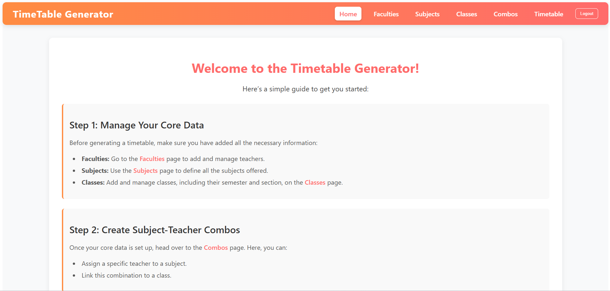
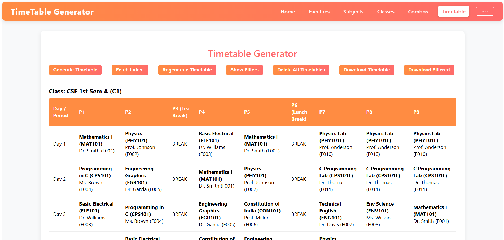
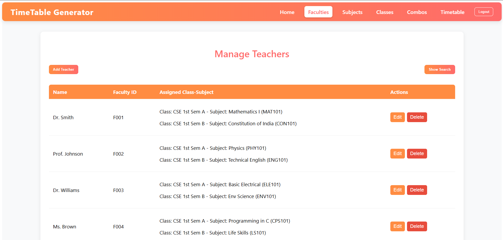
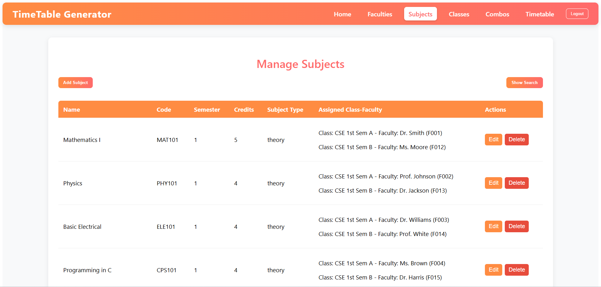
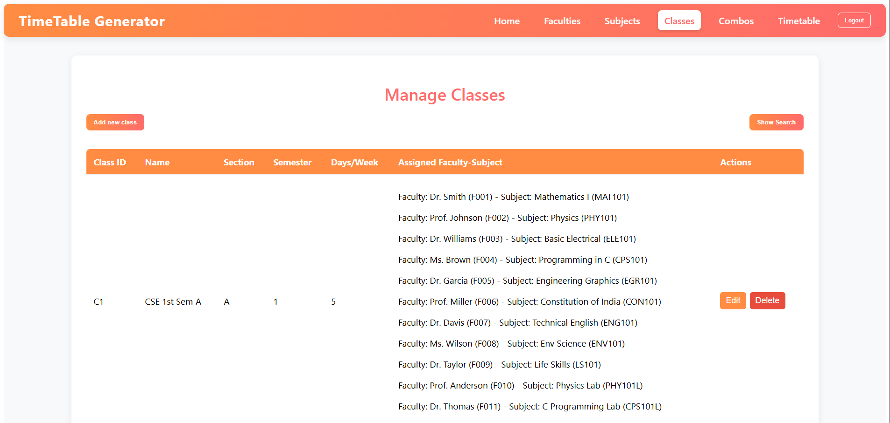
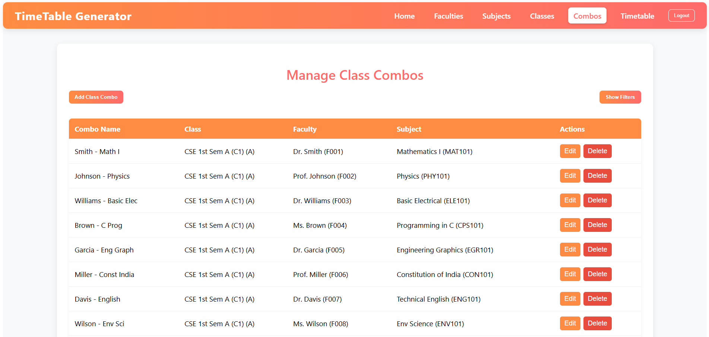

# Timetable Generator - BMSIT

A comprehensive, full-stack web application designed to autonomously generate college timetables using a backtracking algorithm. The system ensures conflict-free scheduling for teachers, subjects, and classes, while adhering to academic constraints like break times and lab blocks.

**🔗 [Live Demo](https://timetable-generator-3tvm.vercel.app/)**

**Demo Credentials:**
- **Email:** `demo@bmsit.in`
- **Password:** `password123`



## 🚀 Features

### Core Generation
- **Backtracking Algorithm:** Efficiently solves the constraint satisfaction problem of scheduling multiple classes and teachers.
- **Academic Constraints:**
    - No teacher overlaps (a teacher cannot be in two places at once).
    - Subject-hour limits per week.
    - Automatic handling of **Lab Blocks** (continuous sessions).
    - Standardized **Tea Break** and **Lunch Break** slots.
- **Manual Overrides:** Support for "Fixed Slots" where users can lock a subject/teacher to a specific period before generation.
- **Score Optimization:** Runs multiple iterations to find the timetable with the fewest "gaps" (best academic score).



### Management
- **Entity Management:** CRUD operations for Faculties (Teachers), Subjects, and Classes.
- **Subject-Teacher Combos:** Link specific teachers to subjects and assign them to classes.
- **Bulk Upload:** Integrated support for **Excel (.xlsx)** imports to quickly populate large amounts of data.
- **Export:** Download generated timetables in **CSV** format for easy distribution.

| Faculties | Subjects |
|-----------|----------|
|  |  |

| Classes | Combos |
|---------|--------|
|  |  |

### Security
- **JWT Authentication:** Secure admin login with token-based session management.
- **Role-Based Access:** Protected routes and ownership checks (users only manage their own data).
- **Rate Limiting:** Protection against brute-force login attempts.

---

## 🛠️ Tech Stack

### Frontend
- **React (v19):** Modern component-based UI.
- **Vite:** Next-generation frontend tooling for fast builds.
- **React Router:** SPA navigation and protected routes.
- **Axios:** API communication with credentials.

### Backend
- **Node.js & Express:** Robust server-side logic.
- **MongoDB & Mongoose:** Schema-based data modeling.
- **JWT & Bcrypt:** Secure authentication and password hashing.
- **XLSX:** Powerful Excel parsing and generation.

---

## ⚙️ Installation & Setup

### Prerequisites
- Node.js (v18+)
- MongoDB (Local or Atlas)

### 1. Clone the Repository
```bash
git clone https://github.com/Nakul-26/timetable_generator
cd timetable-bmsit
```

### 2. Backend Setup
```bash
cd backend
npm install
```
Create a `.env` file in the `backend/` directory:
```env
PORT=5000
MONGO_URI=mongodb+srv://...
JWT_SECRET=your_secret_key
CORS_ORIGINS=http://localhost:5173
```

### 3. Frontend Setup
```bash
cd ../frontend
npm install
```
Create a `.env` file in the `frontend/` directory (optional):
```env
VITE_API_URL=http://localhost:5000/api
```

### 4. Seed Demo Data (Optional)
To quickly see the application in action with 16 teachers and 20 subjects:
```bash
cd ../backend
npm run seed-demo
```

---

## 🏃 Running the Application

Open two separate terminals:

**Terminal 1 (Backend):**
```bash
cd backend
npm run dev
```

**Terminal 2 (Frontend):**
```bash
cd frontend
npm run dev
```
Navigate to `http://localhost:5173`.

---

## 📂 Project Structure

- `backend/models/`: Mongoose schemas (Admin, Class, Faculty, Subject, etc.).
- `backend/models/lib/`: Core backtracking generator and runner.
- `backend/models/routes/`: API endpoints for CRUD and generation.
- `frontend/src/pages/`: UI for management and timetable visualization.
- `frontend/src/api/`: Axios configuration and interceptors.

---

## 📄 License
ISC License. Built for BMSIT.
